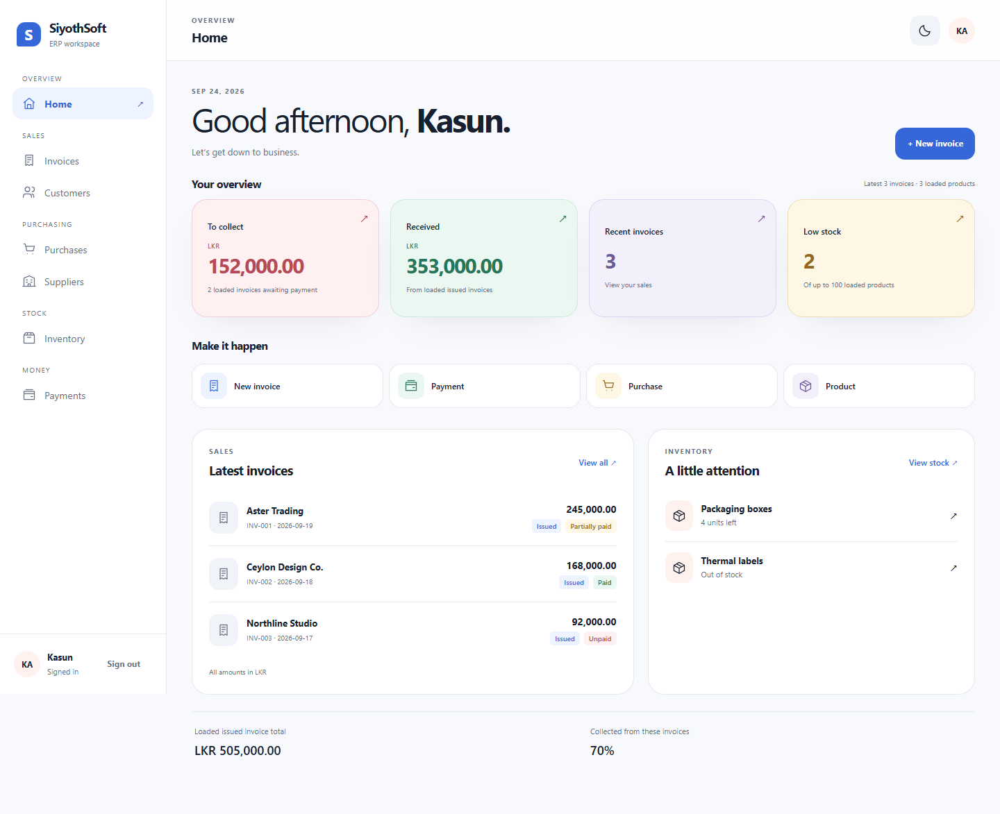
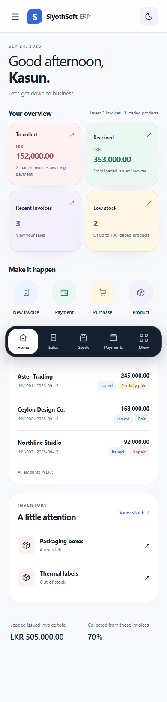
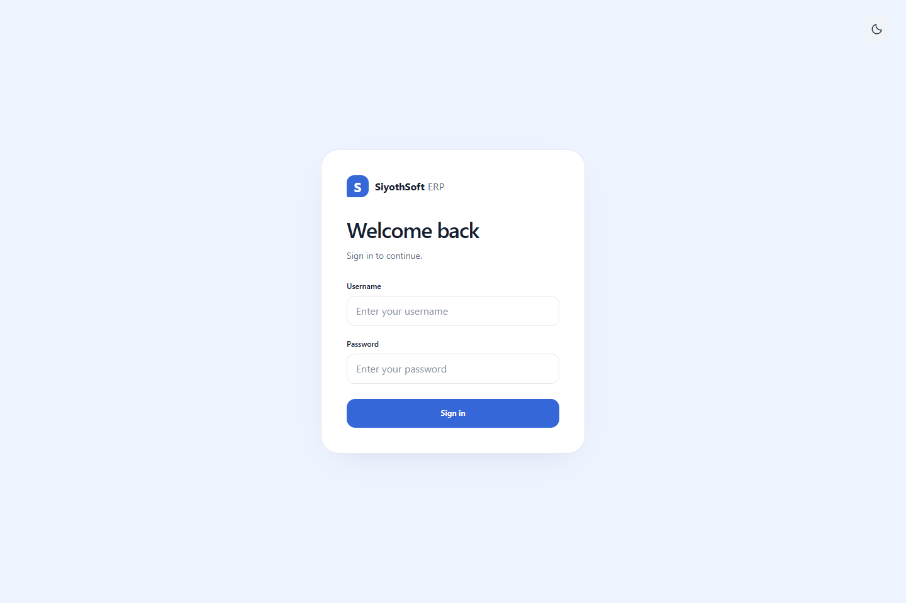

# SiyothSoft ERP

**A clearer way to manage everyday business.**

`Inventory` · `Sales` · `Invoices` · `Purchases` · `Payments` · `Customers` · `Suppliers` · `Small Business`

## What is SiyothSoft ERP?

SiyothSoft ERP is a simple business workspace that brings daily sales, purchases, stock and payment records together in one place.

It helps a business answer everyday questions quickly:

- What products do we have available?
- What did we buy from suppliers?
- What did we sell to customers?
- Which invoices have been paid?
- Who still has an outstanding balance?
- Which products need attention?

The goal is to make business records easier to understand and easier to act on.

## Who is it for?

SiyothSoft ERP is designed for small businesses, shops, distributors and growing teams that want a clear view of their daily operations without spreading information across notebooks and separate files.

It is especially useful for a business that needs to connect its product list, stock movement, customer sales, supplier purchases and incoming payments.

## What can you do with it?

- Keep a list of products and their prices.
- Record how many items are available.
- Add purchases from suppliers.
- Create sales invoices for customers.
- Follow paid, partly paid and unpaid invoices.
- Record payments received from customers.
- See balances that still need to be collected.
- Keep customer and supplier details together.
- Protect paid records from accidental changes.
- Use the workspace comfortably on a computer or phone.

## Main areas

| Area | What it helps you manage |
| --- | --- |
| Home | A quick view of sales, money received, unpaid amounts and products needing attention. |
| Products | Product names, prices and available quantities. |
| Inventory | Current stock and quantity corrections. |
| Invoices | Customer sales, invoice totals, balances and payment status. |
| Purchases | Supplier purchases and the items added to stock. |
| Payments | Money received and payment history. |
| Customers | Customer names and contact details. |
| Suppliers | Supplier names and contact details. |

## A typical day

1. Add products and record the opening quantities.
2. Record a purchase when new goods arrive.
3. Create an invoice when goods are sold.
4. Check the remaining stock and unpaid balances.
5. Record the customer payment when it arrives.
6. Use the Home page to see what needs attention next.

## Screenshots

### Business overview on a computer



### Business overview on a phone



### Welcome screen



## Why it is useful

SiyothSoft ERP keeps the important parts of a small business connected:

```text
Products → Purchases → Stock → Sales → Invoices → Payments
```

When a purchase is recorded, stock increases. When an invoice is created, stock decreases. When a payment is received, the outstanding balance becomes easier to follow.

## Current focus

This project focuses on the everyday operating side of a business. It is not intended to replace a full accounting, payroll, tax or card-payment service.

The workspace is being developed as a practical, learning-first business application with a clean visual style and a focus on clear records.
